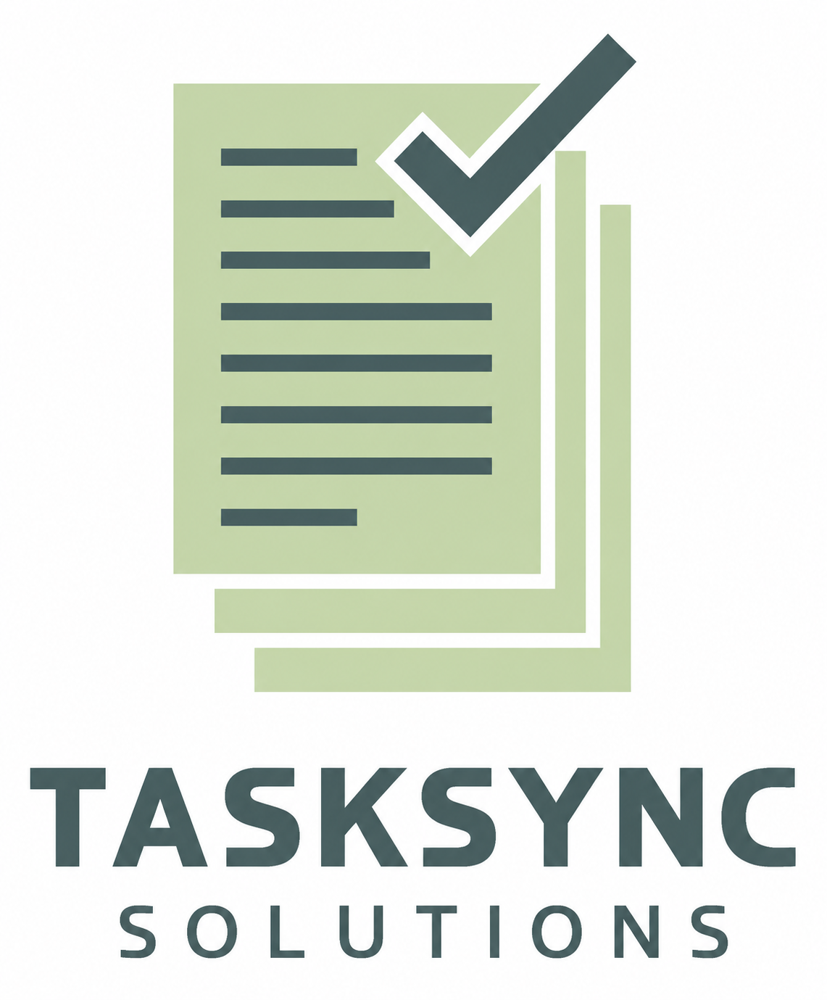

# TaskSync - Sistema de Gerenciamento de Tarefas

## Sobre o Projeto

**TaskSync Solutions** é uma aplicação web desenvolvida para gerenciamento de tarefas, permitindo que empresas e colaboradores organizem suas atividades em três colunas: **A Fazer**, **Fazendo** e **Concluído**.

O sistema foi desenvolvido como solução para uma empresa fictícia que migrou de quadros físicos para uma plataforma digital, visando maior integração e visibilidade entre os setores.

---

## Identidade Visual

- **Fonte:** Segoe UI, system-ui, Roboto
- **Logotipo:** Personalizado (TaskSync Solutions)
- **Paleta de Cores:**
  - Verde escuro: `#2d4a3a` (botões, títulos)
  - Verde médio: `#4a7a5a` (hover)
  - Verde claro: `#C4D4A9` (gradiente de fundo)
  - Cinza-esverdeado: `#809289` (gradiente de fundo)
  - Branco: `#ffffff` (cards e formulários)

---

## Credenciais de Teste (Pré-cadastradas)

### Email

- kaorishimada11@gmail.com

### Senha

- 123456

## Desenvolvedor

- kaorishi11